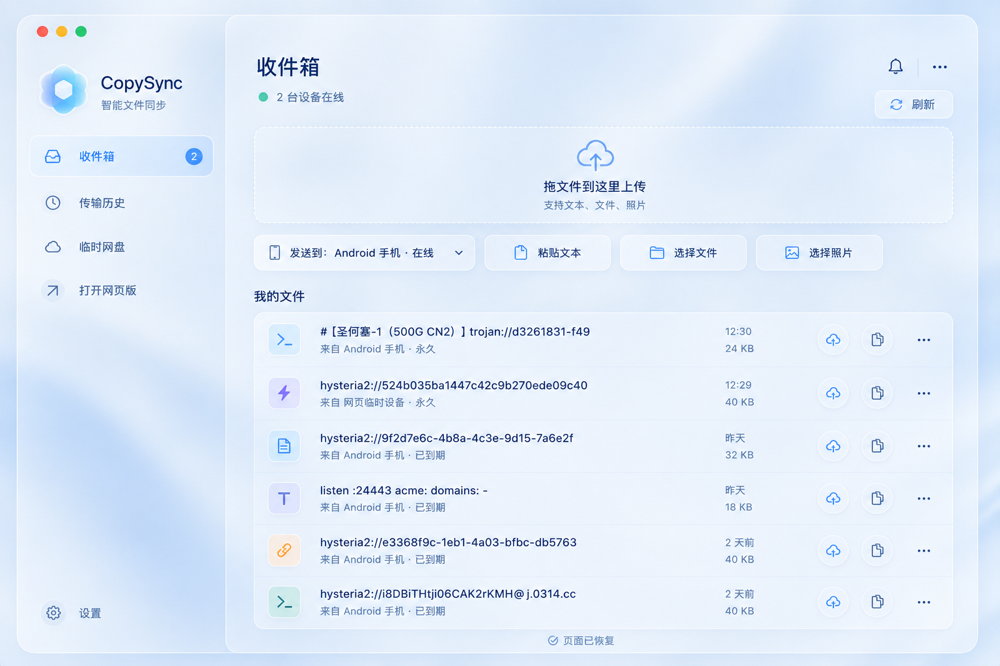

# CopySync V3：API-first、Flutter 双端与三端 UI 重构设计

> 执行对象：Kimi。本文是已获 Zane 确认的约束性设计，不是可自由发挥的方向稿。实现前须另写实施计划；未经 Zane 确认不得改变范围、视觉或迁移策略。

## 1. 目标与发布方式

CopySync V3 在一个公开发布窗口内同时交付：

- 稳定的 `/api/v1` JSON API 与每设备独立认证；
- Mac 与 Android 共用一套 Flutter UI 和业务代码；
- 保留并桥接现有 Objective-C/Kotlin 原生能力；
- Mac、Android APK 与网页三端 UI 重构；
- 图片原件与通用剪贴板版本的完整处理链路；
- Mac 与 APK 新版本、网页版和服务端同步上线；
- 旧剪贴板 API 和旧客户端退出。

“一次性完成”指一次公开发布，不指未经验证的大爆炸开发。内部必须按 API、Flutter、原生桥接、UI、迁移和发布候选阶段逐项验证。

## 2. 已验证现状

当前 `app.py` 并非传统逐页服务端渲染：HTML/CSS/JS 虽内嵌在 Python 文件中，但列表、设备、传输、容量和操作已通过 `/api/items`、`/api/devices`、`/api/transfers` 等 JSON 接口驱动。

当前系统已经具备 SQLite 元数据、文件目录、设备表、在线心跳、定向发送、收件确认、传输历史、SSE 更新、图钉和过期模型。V3 必须迁移并复用这些数据与语义，不能另建平行后端。

Mac 与 Android 原生代码直接调用旧 API，因此正式删除旧 API 前必须完成并验证 Flutter 双端；本设计不采用一个发布周期的旧协议兼容层。

## 3. 不可协商的强约束

以下任一项不满足，V3 不得发布，也不得声称完成：

1. 现有全部用户功能必须存在、真实可用且不降级；不得删除、隐藏、占位或仅弹提示。
2. 所有按钮必须连接真实 API 或原生能力，具有进行中、成功和失败反馈；请求中防止重复触发。
3. 所有窗口尺寸、长文本和系统字体放大场景下，按钮不得重叠、被遮挡、被裁剪或超出可视区域。
4. Mac 与桌面网页必须严格按照本文参考图实现，不得自行更换颜色、导航、顺序或视觉风格。
5. Android 除已批准的“底部导航 + 单列内容”外，功能、顺序、颜色、卡片、图标和反馈必须与 Mac 一致，不得另做一套 Material 风格。
6. 网页和 Mac 必须在真实 GUI 中逐按钮模拟手动操作；APK 必须安装到 Mac 上的 Android Emulator，通过鼠标、键盘模拟触摸和输入逐项操作。自动测试不能替代该门槛。
7. Android Emulator 不能证明厂商后台限制和真实剪贴板行为；正式声称 Android 后台能力完整验证前，必须再做一台真实 Android 的最小冒烟测试。
8. 不清空或覆盖现有 SQLite、文件、图钉、有效期、传输历史、用户配置及原生权限身份。

## 4. 视觉基准

下图是 Mac 与桌面网页唯一视觉基准。实现时把截图对照置于审查流程中，颜色数值可为截图对齐微调，但不能形成新方案。



参考图文件 SHA-256：`3e044aa09c84e47de171292f0a7852e68260580ba25b344f084983393725a4d0`。

视觉规则：

- 使用高饱和、清透蓝作为主色，深蓝用于标题与主要文字；保留中性灰蓝。
- 使用浅蓝环境渐变、半透明浅色面板、24–32px 模糊、轻微饱和增强、1px 白色描边和柔和阴影。
- 严格对齐参考图中的圆角、留白比例、线性图标、列表行高、标题层级和操作密度。
- Mac 使用真实系统窗口控制；网页不得伪造不可用的系统窗口按钮，其余桌面布局同构。
- Android 使用底部导航与单列内容；小屏放不下的次要操作进入真实可用的更多菜单，不缩小到不可点击。
- 所有可点击区域至少 44×44；焦点态、悬停态、按下态、禁用态、加载态、成功态和错误态均须可辨认。

## 5. 总体架构

```text
SQLite + 文件目录
        ↑
Python /api/v1
   ↙           ↘
Flutter         轻量 Web
Mac + Android   HTML/CSS/JS
   ↓
平台桥接
macOS Objective-C / Android Kotlin
```

### 5.1 服务端

Python 服务端继续作为唯一事实源，保留现有 SQLite、文件目录、容量、清理、图钉、过期和传输语义。`app.py` 不再内嵌完整客户端；Web 资源拆为独立 HTML/CSS/JS，由服务端静态托管。

不引入第二套服务、消息队列、对象存储或前端框架。SSE 只通知“有新版本”，实际状态始终通过游标同步接口读取。

### 5.2 Flutter

一个 Flutter 工程同时产出 Mac 与 Android UI，共用：

- API 模型、认证、设备、项目、传输和同步逻辑；
- 收件箱、传输历史、临时网盘、设置页面；
- 设计 token、列表、操作按钮、反馈和错误状态；
- 文本、文件和图片发送/接收流程。

状态只保留认证、同步、项目和按钮操作所需内容。不得增加无需求支撑的仓库层、服务定位器、代码生成体系或多套状态框架。

### 5.3 原生桥接

Flutter 替换 UI 与共享业务层，但不重写已经验证的系统能力：

- macOS Objective-C：菜单栏、全局快捷键、剪贴板监听、截图、粘贴到前一应用、权限、登录启动、通知、文件定位、更新安装。
- Android Kotlin：系统分享、文件/照片选择、下载与打开、通知、后台恢复、安装 APK 更新及系统限制处理。

Dart 侧只依赖一个稳定的桥接接口。每个调用必须返回结构化成功或错误结果，不得静默失败。

### 5.4 网页

网页保持轻量 HTML/CSS/JS，不使用 Flutter Web。它与 Flutter 共用 `/api/v1`、资源语义和视觉 token，但不共用渲染代码。

## 6. API v1 与认证

### 6.1 认证与设备

- `POST /api/v1/auth/login`：验证密码并注册设备，签发该设备独立 Token。
- `POST /api/v1/auth/logout`：撤销当前 Token。
- `GET /api/v1/devices`：返回设备名称、平台、在线状态和最后活动时间。
- `PATCH /api/v1/devices/{id}`：设备改名。
- `DELETE /api/v1/devices/{id}`：撤销设备和其全部 Token。
- `POST /api/v1/devices/{id}/heartbeat`：更新当前认证设备在线状态；路径设备必须与 Token 一致。

原设备身份只能从 Token 得出，不接受请求体伪造 `source_device`。目标设备必须存在且未撤销。

原生 Token 存入系统安全存储。网页使用 `Secure + HttpOnly + SameSite` Cookie，不把 Token 放入 URL、HTML、JavaScript 可读存储或日志。数据库只保存 Token 哈希。

### 6.2 项目与传输

- `GET /api/v1/sync?cursor={cursor}`：增量读取项目、设备、传输、状态变化和删除墓碑。
- `GET /api/v1/events`：SSE 版本通知。
- `POST /api/v1/items`：按 `Content-Type` 接收 JSON 文本或 multipart 文件/图片。
- `GET /api/v1/items/{id}`：项目元数据。
- `PATCH /api/v1/items/{id}`：图钉、备注和有效期变更。
- `DELETE /api/v1/items/{id}`：删除并记录墓碑。
- `GET /api/v1/items/{id}/content?variant=original|clipboard`：下载原件或通用剪贴板版本。
- `POST /api/v1/items/{id}/deliveries`：定向发送。
- `POST /api/v1/deliveries/{id}/ack`：目标设备确认状态。
- `GET /api/v1/usage`：容量与限制。

所有写请求支持由客户端生成的幂等键。相同设备和幂等键重试必须返回第一次结果，不得创建重复项目或重复发送。

错误响应至少包含稳定 `code`、可显示 `message` 和可选 `details`。HTTP 状态必须与错误性质一致。

### 6.3 增量同步

使用服务端单调递增变更序号。响应包含 `changes`、`tombstones` 和 `next_cursor`。SSE 丢失、睡眠或断网后，客户端以最后持久化游标补齐。

游标不存在、损坏或早于服务器保留窗口时，返回明确的 `full_sync_required`，客户端执行全量同步，不得猜测或静默漏项。本版只交付该契约，不实现客户端完整离线缓存和离线写队列。

### 6.4 数据结构

在现有表上做增量迁移，保留原主键和用户数据。新增结构限定为：

- `device_tokens`：设备、Token 哈希、创建/使用/撤销时间；
- `item_blobs`：项目、`original|clipboard` 变体、路径、MIME、大小和 SHA-256；
- `sync_changes`：序号、实体、实体 ID、操作和时间；
- `idempotency_keys`：设备、请求键、结果引用和过期时间。

迁移必须可重复执行，并在事务内完成数据库部分。文件变体写入临时文件，校验完成后原子改名。

## 7. 图片剪贴板链路

每个图片项目保留：

- `original`：HEIC、WebP、GIF、JPEG、PNG 等原始内容；
- `clipboard`：可直接写入系统剪贴板的 PNG，普通照片可使用高质量 JPEG。

规则：

- 下载默认返回原件；“复制/粘贴”读取 clipboard 变体。
- GIF 原件保留动画，clipboard 变体使用首帧 PNG。
- 图片复制后只进入本地历史，必须由用户手动选择发送或上传；禁止默认自动上传。
- 从浏览器复制图片时，Mac 后台尝试下载来源原图，同时保存系统剪贴板位图为通用变体。
- 原图下载失败时仍保留可粘贴版本，并明确标记缺少原件；不得丢弃已取得的数据。
- 转换优先使用 Mac ImageIO 与 Android 原生解码能力，服务端只校验和保存变体，避免在 VPS 引入沉重图像处理栈。
- 接收端缺少 clipboard 变体时，可由原生解码器本地生成并缓存；转换失败必须显示具体格式和失败原因。

## 8. 页面与交互

### 8.1 桌面 Mac 与网页

左侧栏固定为：品牌、收件箱、传输历史、临时网盘、打开网页版、底部设置。

收件箱主区固定为：标题与在线设备数、刷新、拖拽上传区、目标设备、粘贴文本、选择文件、选择照片、我的文件列表。

列表固定展示：类型图标、标题、来源与状态、时间与大小、主要操作和更多菜单。列表内容过长时省略显示但可访问完整值，操作区不能被挤出。

### 8.2 Android

底部导航固定为收件箱、传输历史、临时网盘、设置。页面内容改单列，其余名称、顺序、功能和反馈与 Mac 一致。

### 8.3 操作反馈

每个操作拥有独立 `idle/loading/success/error` 状态：

- 点击后立即进入加载态并禁止重复点击；
- 成功后更新真实数据并给出短反馈；
- 失败保留原数据，显示原因和重试入口；
- 删除、彻底清空和撤销设备必须二次确认；
- 不允许静态图标冒充操作、空按钮、假链接或只显示成功而未验证结果。

Mac 剪贴板历史保持键盘优先：输入即搜索、方向键选择、回车复制并粘贴；鼠标操作必须同样完整。

## 9. 现有功能零回退矩阵

实施计划必须把每一行继续拆成“旧入口 → 新页面/桥接/API → 自动测试 → GUI 人工结果”。下列任一能力缺失即阻止发布。

| 平台 | 必须保留并验证的能力 |
|---|---|
| 通用 | 登录、退出、修改密码、设备名称、在线状态、定向发送、文本/文件/照片上传、收件确认、30 天传输历史、临时网盘、搜索、类型筛选、图钉、备注、续期、复制、下载、删除、清理临时内容、彻底清空、容量、过期规则、刷新、实时变化和更新提示 |
| Mac | 菜单栏、主窗口快捷键、历史浮窗快捷键、区域截图、文本/图片本地历史、去重、历史悬浮固定、复制并粘贴到前一应用、忽略下一次复制、登录启动、状态栏开关、屏幕录制/粘贴权限入口、接收保存与 Finder 定位、缓存目录、清理历史/缓存、检查下载及覆盖安装更新 |
| Android | 底部导航、下拉刷新、系统分享入口、分享前确认、文件/照片选择、接收通知、下载状态恢复、重复文件名处理、打开已接收文件、发送内容转存、检查下载及安装 APK 更新 |
| 网页 | 线路探测与手动选择、登录、拖拽上传、粘贴文本、目标设备、全部列表操作、搜索筛选、容量、在线设备数、刷新和实时变化通知 |

WebView 自动恢复是旧实现保护。Flutter 退役 WebView 后不保留无意义回调，但必须以原生加载错误、认证失效、同步断线、重试和稳定 UI 替代对应用户可见可靠性。

## 10. 错误处理与数据安全

- 网络失败不删除本地数据、不提前显示成功；重试复用幂等键。
- Token 失效时明确重新登录；设备撤销后停止同步并说明原因。
- 上传先写 `.part`，验证大小、MIME、SHA-256 和容量后原子提交；失败清理半成品。
- 数据库提交与文件提交必须有补偿清理，不能留下可见的幽灵项目。
- 图片原件或变体失败时分别报告，不用一个模糊“复制失败”掩盖状态。
- 所有敏感值禁止写入日志、设计文档、截图和交接文件。
- 危险操作必须明确目标和影响，且支持取消。

## 11. 验证设计

### 11.1 自动验证

1. 服务端：现有测试继续通过；新增 API 契约、Token 绑定、设备撤销、游标补偿、幂等、迁移、图片双变体、墓碑、容量和安全边界测试。
2. Flutter：共享状态、页面、长文本、加载/空/错误状态、按钮防重和关键流程测试。
3. 平台桥接：Mac 与 Android 分别验证成功、拒绝权限、取消选择、系统错误和恢复路径。
4. 构建升级：新装、旧版覆盖安装、签名、版本、更新清单、SHA-256、数据保留和回滚检查。

### 11.2 强制 GUI 模拟手动操作

网页必须在真实浏览器完成：登录、线路选择、拖拽、文本/文件/图片、设备发送、复制、下载、图钉、备注、续期、删除、清理、刷新、断网恢复及所有设置按钮。

Mac 必须安装正式签名 App，完成：窗口与侧栏、全部列表按钮、菜单栏、快捷键、文本/图片历史、截图、权限、粘贴到前一应用、接收、Finder 定位、清理、设置和覆盖更新。

APK 必须在 Mac 的 Android Emulator 完成旧版覆盖安装和新装，并使用模拟触摸完成：底栏、全部列表按钮、分享 Intent、分享确认、文件/照片选择、发送、接收、下载、通知、后台/前台恢复、旋转、设置和 APK 更新安装。

每个动作必须记录输入、预期、实际结果和截图证据。编译成功、HTTP 200、单元测试通过或静态截图均不能替代该门槛。

### 11.3 视觉与布局

- Mac 与桌面网页按参考图尺寸截图，并使用叠加对照检查结构、间距、颜色和视觉层级。
- Android 在标准手机尺寸及系统字体放大场景截图。
- 默认、加载、空数据、长文本、多按钮、错误、离线和权限拒绝状态全部检查。
- 自动布局测试确保可点击元素位于可视区域且边界不相交。

### 11.4 真机限制

Android Emulator 是强制 GUI 门，但不能证明 Samsung 等 OEM 的后台、电池与真实剪贴板策略。发布前必须由一台真实 Android 最少验证启动、登录、发送、后台收件、图片复制粘贴、分享入口和更新。

## 12. 迁移、切换与回滚

### 12.1 迁移

- 迁移前备份线上 SQLite 与文件索引，并记录校验值和恢复命令。
- Schema 只做增量新增；现有项目主键、路径和基础字段保持可读。
- 在生产数据副本上先跑迁移、回滚和二次执行测试。

### 12.2 一次发布窗口

1. 生成并验证服务端包、Web 静态资源、Mac 签名包、APK 和更新清单。
2. 完成全部自动门、GUI 门、真机冒烟和覆盖升级。
3. 获得 Zane 最终 go/no-go。
4. 备份线上数据，原子部署 `/api/v1`、新版网页和迁移。
5. 发布 Mac/APK 更新清单；旧 CRUD 路由只返回 `426 Upgrade Required`，不继续提供业务兼容。更新清单路由保留，使旧客户端能够升级。
6. 在线复测登录、发送、收件、图片粘贴、下载和更新链路后才宣布完成。

### 12.3 停止与回滚条件

数据迁移、登录、上传、收件、图片粘贴、更新或签名任一失败，立即停止发布。回滚使用已验证备份、旧服务包、旧网页和旧更新清单；不得在未知状态下继续推送其他端。

## 13. 实施阶段

1. 冻结基线：现有功能矩阵、三端截图和手动结果。
2. API 与数据：Schema、设备 Token、API v1、游标、幂等、图片变体和迁移。
3. Flutter 纵向闭环：先登录/设备/文本，再文件/图片；接入两端原生桥接。
4. 功能与 UI：恢复矩阵全部项目，完成 Mac、Web、Android 视觉对齐。
5. 发布候选：自动测试、GUI 模拟手动操作、真机、覆盖升级、签名和回滚。
6. 一次公开发布：服务端、Web、Mac 与 APK 在同一窗口切换。

每阶段完成后必须更新 `.ai/HANDOFF.md`，记录真实验证命令和结果。不得跨过失败阶段继续堆叠实现。

## 14. 明确不做

- Flutter Web；
- 复制图片后自动上传；
- 本版客户端完整离线缓存和离线写队列；
- 正式发布后的旧业务 API 兼容；
- 多用户、注册、对象存储、分片上传或无关大重构；
- 第二套后端、第二套设备模型或第二套导出/传输管线；
- 未经 Zane 确认的 UI、导航、功能顺序或范围变化。

## 15. 完成定义

只有以下条件全部成立，Kimi 才能把任务交回并标记完成：

- 功能矩阵无缺失、无降级；
- 所有按钮真实可用、有反馈、无重叠；
- API、迁移、Flutter、原生桥接、升级和回滚测试全部通过；
- 网页、Mac、Android Emulator 完成逐项 GUI 模拟手动操作；
- Android 真机完成最小冒烟；
- 三端视觉截图通过参考图对照；
- Mac 与 APK 已发布新版，网页和服务端已切换；
- 线上登录、发送、收件、图片粘贴和更新链路再次实测通过；
- 剩余限制和风险已明确记录，且不存在阻止发布的问题。

## 16. 技能使用页

本节约束 Kimi 与 Codex 在 CopySync V3 中使用技能的时机。技能用于提高执行可靠性，不能覆盖本文设计、扩大权限或替代真实验证。

| 阶段或情形 | 必须使用的技能 | 作用与限制 |
|---|---|---|
| 开始、恢复、交接和每个验证检查点 | `project-handoff` | 先读 `.ai/HANDOFF.md`，再核对 Git、文件、测试和运行状态；实际证据优先于交接摘要 |
| 用户要求改变已批准需求、架构、范围或行为 | `brainstorming` | 重新确认设计并获得批准；普通实现细节不借此扩大范围 |
| 已批准设计进入实施前 | `writing-plans` | 把本文拆为可执行、可验证的纵向阶段；计划必须包含功能零回退矩阵和发布门 |
| 实现任何功能、修复或行为变化 | `test-driven-development` | 先写能正确失败的最小测试，再实现；不能用事后补测试冒充 TDD |
| Flutter Mac/Android UI、状态和平台集成 | `flutter-expert` | 约束共享 Flutter 代码与平台差异；不得以 Flutter 为由重写已验证原生能力 |
| 测试失败、功能异常或 GUI 与数据不一致 | `systematic-debugging` | 先定位根因和共同调用路径，再做最小修复；禁止凭猜测大改或重装 |
| 网页自动化验证 | `webapp-testing` | 验证本地网页、浏览器日志、上传、拖拽和交互；自动化结果不能替代 GUI 模拟手动操作 |
| 网页真实 GUI 操作与截图 | `browser:control-in-app-browser` | 在真实页面逐按钮操作并留存证据；不得只读 DOM 或只调用 API |
| Mac App 与 Android Emulator GUI 操作 | `computer-use` | 操作正式构建、系统菜单、快捷键、权限、模拟触摸、分享和更新；编译成功不能替代操作结果 |
| 准备声明修复、阶段完成或测试通过 | `verification-before-completion` | 运行新鲜、完整的验证命令并读取实际结果；旧日志和代理报告不是证据 |
| 阶段完成、发布候选、推送前、推送后和最终完成 | `copysync-v3-completion-gate` | 读取本文并检查全部适用门；任一项失败或无证据必须输出“未完成” |

### 16.1 推荐调用顺序

```text
project-handoff
→ writing-plans
→ test-driven-development + flutter-expert
→ systematic-debugging（出现异常时）
→ webapp-testing / browser / computer-use
→ verification-before-completion
→ copysync-v3-completion-gate
```

若实现中改变需求或设计，在修改代码前插入 `brainstorming` 并重新获得 Zane 批准。

### 16.2 完成门的使用边界

`copysync-v3-completion-gate` 只约束 V3，并以本文为唯一权威。它自动适用于 API、数据迁移、Flutter、原生桥接、网页、图片链路、UI、构建、更新和部署工作，但不适用于未来尚未设计的 V4。

完成门不执行发布、不替代 Zane 的 go/no-go，也不把自动测试、HTTP 200、编译成功或静态截图视为 GUI 和真机证据。
